# 不到10MB 免费 Markdown 编辑器：公式、图表、搜索全内置，一个插件都不用装

我写文档的方式很单调：打开编辑器，敲字，关掉。

但为了这串动作，我得先做一串准备工作。

**用 VS Code**，得先装插件：Markdown 预览增强、数学公式、图表渲染……一个接一个。装完内存常常到几百 MB，启动要等几秒。它当然强大，可我只是想写两千字。

**用 Typora**，体验确实是轻的，但它要 ¥88。一个写字的工具而已，我总觉得"写 Markdown"这件事不该花钱。

所以我自己写了一个：**TizuMark**。

**不到10MB，免费。**

双击就开，不等启动动画。数学公式、流程图、代码高亮、三种搜索，全都在里面——**一个插件都不用装**。

---

## 它到底强在哪

下面是它在做的事，扫完 30 秒就知道合不合适：

- **一个插件都不用装** — KaTeX 数学公式、Mermaid 图表、100+ 语言代码高亮、三种搜索，全部内置。没有插件互相打架，没有升级后某个插件突然失效，换台机器也不用重新配一遍
- **双击就开，不到10MB / 内存不到 50MB** — Rust + Tauri v2，直接用系统自带的 WebView，不打包整个 Chromium
- **三种搜索，找什么都能秒到** — `Ctrl+F` 文档内查找替换、`Ctrl+H` 跨文件搜索、`Ctrl+P` 文件速达
- **写作该有的都在** — 分屏实时预览 + 滚动同步、大纲导航、面包屑、文件树工作区、多标签页（可拖拽排序）、斜杠命令
- **长文档不卡** — 分块渲染 + 焦点窗口化 + 纯预览虚拟滚动，数万行依然流畅
- **想怎么配就怎么配** — 5 套配色方案；编辑器 / 预览 / 代码块三处字体分别设置，系统已装字体全量列出可搜索，还能导入自己的字体文件；**每一条快捷键都能改**，另有四套预设方案
- **图片省心** — 粘贴自动 MD5 去重，可选存 assets/ 或 Base64 内嵌，支持相对路径，点击可放大查看
- **导出的活顺手也干了** — Word / HTML / PNG 长图 / PDF 四种，不用装 Pandoc 之类的额外工具
- **完全离线** — 不用注册账号，不用联网，打开就能写

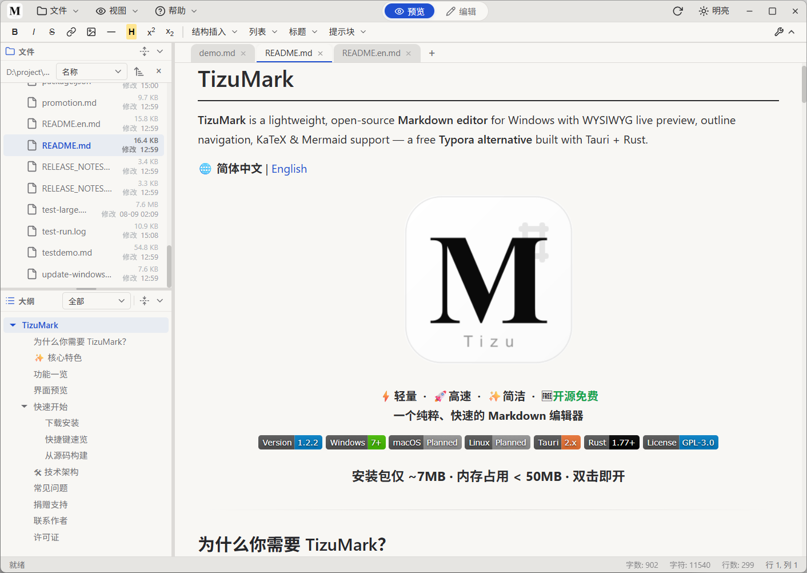

---

## 先看几个数字

下面是实测的典型值，不同机器会有出入，仅供参考。

| | VS Code | Typora | TizuMark |
|---|---|---|---|
| 安装包 | 80~150 MB | 30~50 MB | **约 9 MB** |
| 内存占用 | 300~800 MB | 200 MB+ | **< 50 MB** |
| 冷启动 | 3~8 秒 | 1~2 秒 | **< 1 秒** |
| 价格 | 免费 | **¥88 付费** | **免费** |
| 数学公式 | **需插件** | 内置 | 内置（KaTeX） |
| 图表 | **需插件** | ✗ | 内置（Mermaid） |
| 目录级搜索 | **需配置** | ✗ | 内置（跨文件搜索） |
| 文件速达 | 内置 | ✗ | 内置（Ctrl+P） |
| 自动更新 | 需手动 | 有 | **内置（自动检查 + 一键升级）** |
| 中文界面 | 需汉化 | 内置 | **原生中文（兼英文）** |

不到 10 MB 大概是一张手机照片的大小。内存通常不到 50 MB——作为参照，Chrome 开一个标签页往往就超过这个数。

小不是靠后期优化压出来的，是架构决定的：**Rust + Tauri v2**，直接用系统自带的 WebView，而不是像 Electron 那样把整个 Chromium 打包进安装包。

---

## 三种搜索

写文档真正费时间的不一定是写，是找。所以搜索这块做了三套，各管一摊。

### Ctrl+F — 文档内查找替换

边输边搜，右侧实时显示匹配数。**编辑区和预览区会同时高亮**，分屏模式下扫一眼就能定位，不用在源码和渲染结果之间来回切。

支持区分大小写、正则表达式、循环查找。替换和全部替换支持 `$1`、`$&` 这类正则反向引用，批量改格式或统一术语时很省事。

选中一段文字再按 Ctrl+F，选中的内容会自动填进查找框。纯预览模式下调出的是独立的预览查找面板，会带走你在页面上选中的文字。

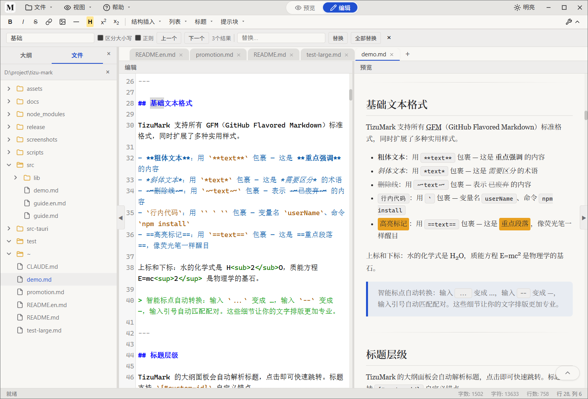

### Ctrl+H — 跨文件搜索

写项目文档、整理笔记库时，这个用得最多。很多轻量编辑器只做得到"当前文件里搜一搜"，跨文件得靠外部工具。

搜索范围二选一：**已打开的所有标签页**，或者**指定一个目录**递归搜。结果按文件分组，每个文件头部显示路径和匹配数，下面列出每条匹配的行号、列号和上下文片段，顶部给出总数。

点任意一条就跳过去：自动打开文件、选中匹配文本、滚动到视野内，**编辑区和预览区同时高亮定位**，而且不会改动你当前的视图模式。

目录遍历是 Rust 原生实现的（一次递归扫描，不是逐目录来回调用），自动跳过 `node_modules`、`target`、`.git` 和点开头的目录，默认只搜 md / markdown / txt。检索带上限保护（目录范围最多 2000 个文件、总计 5000 条匹配），大目录不会把界面卡死。

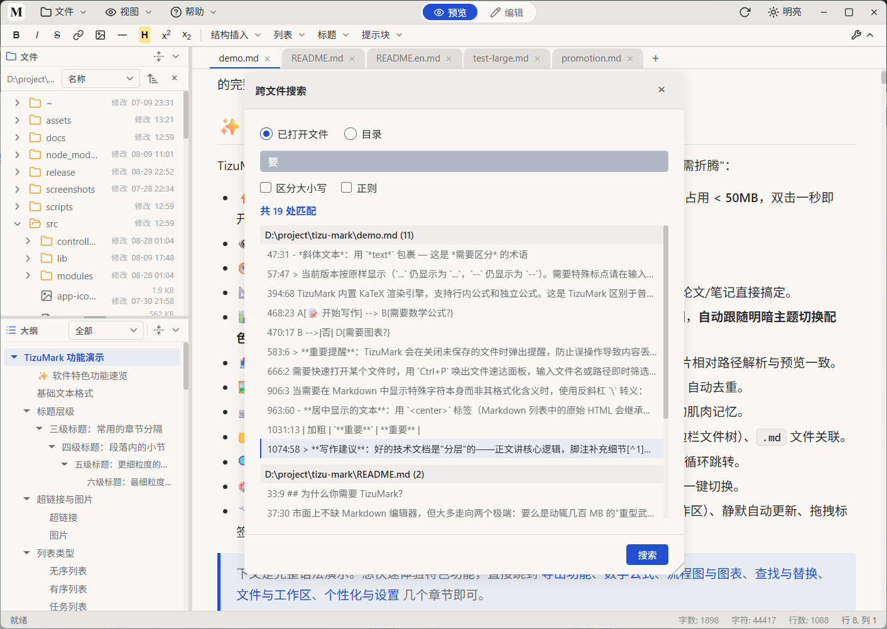

> 说个中间改过一次键位的小事。跨文件搜索原本规划的是 `Ctrl+Shift+F`，实测发现这个组合被搜狗、微软拼音的「简繁切换」在系统层就截走了，按键根本传不到应用里。所以改成了 `Ctrl+H`。这种为中文用户避开输入法热键的取舍，是很多国外编辑器不会替你考虑的。

### Ctrl+P — 文件速达

类似 VS Code 的 Quick Open：输入即筛文件名和路径，`↑` `↓` 选择，回车打开，`Esc` 或点击面板外关闭。

文件列表由 Rust 端一次原生遍历工作区得到（没开工作区时退回当前文件所在目录），上限 5 万个文件；窗口重新获得焦点时会重扫，刚建的文件立刻能搜到。空输入时列出工作区前 50 个文件（按文件名排序），当快速切换器用也顺手。

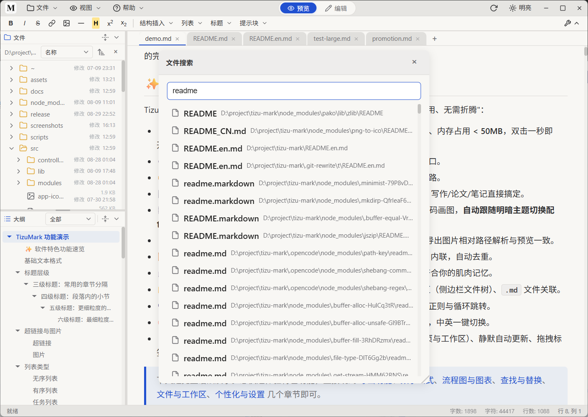

> 三个搜索的快捷键都可以改，在「快捷键设置」里。

---

## 界面按写作习惯排布

**实时预览 + 同步滚动** — 左边写右边看，光标指到哪预览跟到哪，不用切模式。想专注的时候按 `Ctrl+\` 在编辑/预览之间直接切。

**多标签页** — 同时开十几个文件也不挤，标签太多可以左右滚动，还能拖拽排序。

**大纲导航** — 长文档自动解析标题层级，侧边栏点一下就跳。支持折叠子树、宽度拖拽、整体隐藏。

**面包屑** — 编辑器顶部显示当前标题路径，随时知道自己在文档的哪一层，点一下跳回去。

**斜杠命令** — 输入 `/` 唤出命令列表，插表格、公式、图表、提示块都可以不碰鼠标。命令能排序、能隐藏，只留常用的。

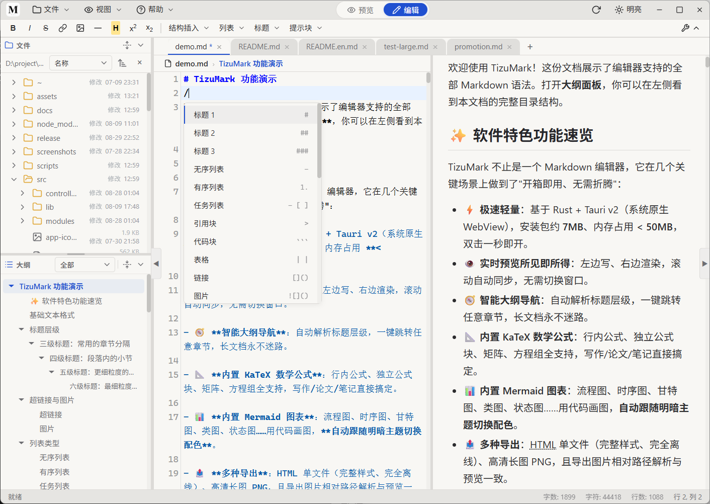

---

## 公式、图表、代码

这几样是写技术文档绕不开的。在 VS Code 里得靠插件拼起来，在 TizuMark 里是内置的，不用装任何东西：

**KaTeX 数学公式** — `$E=mc^2$` 行内，`$$\sum_{i=1}^n i^2$$` 独立成块，矩阵、方程组都支持。不需要装 LaTeX。

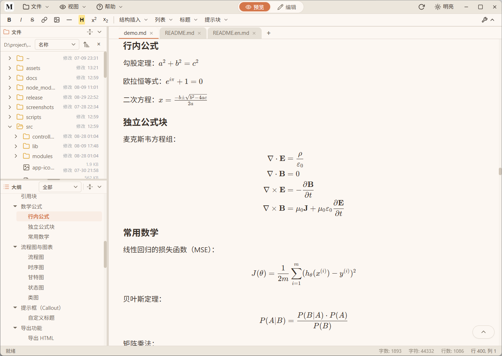

**Mermaid** — 流程图、时序图、甘特图、状态图、类图、饼图，代码写完自动渲染。

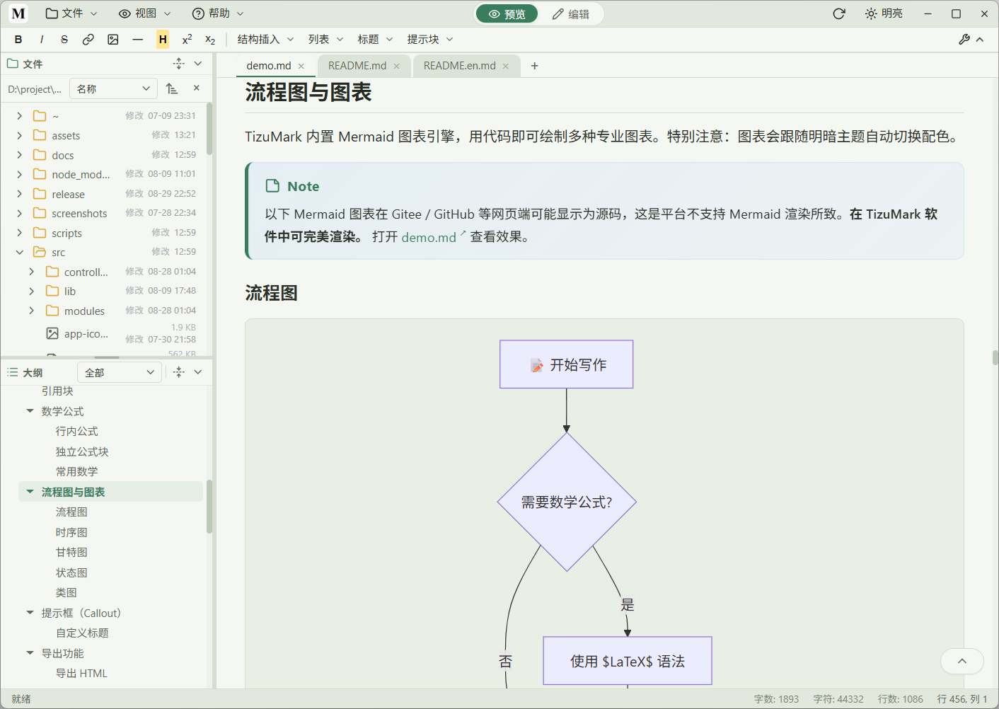

**代码块高亮** — 100+ 语言自动识别着色，鼠标移到代码块上有复制按钮。行号和自动换行默认关闭，需要的可以在设置里打开。

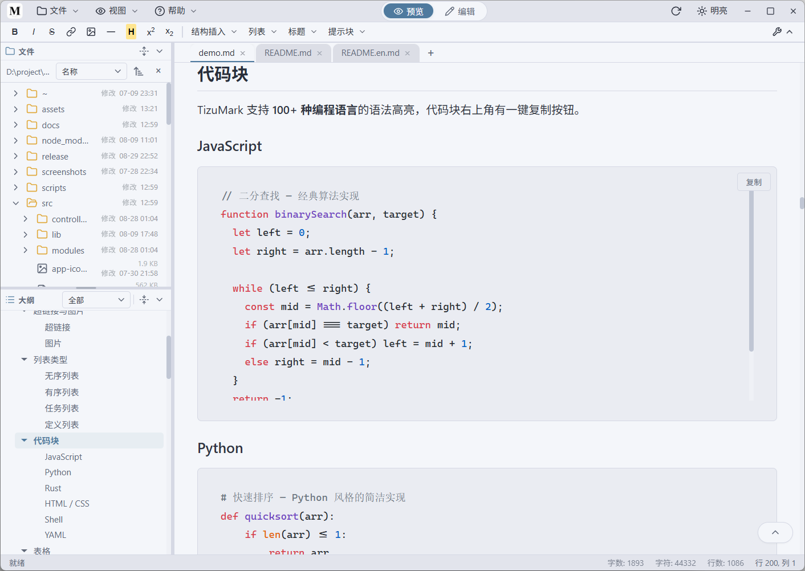

**GFM 语法和几个额外能力：**

| 能力 | 说明 |
|---|---|
| 任务列表 | `- [ ]` `- [x]`，预览里可直接点击勾选，源码同步 |
| 提示块 | Note / Tip / Warning / Caution / Important 五种 |
| 高亮标记 | `==文本==` |
| 上标 / 下标 | `x²` `x₂` |
| 脚注 | 带反向链接 ↩ |
| 定义列表 | 术语 -> 定义 |
| Emoji 短代码 | `:rocket:` → 🚀 |
| 目录 | `[TOC]` 自动生成 |
| 缩写 | `*[HTML]: HyperText...` |
| 智能标点 | 自动优化中英文标点 |
| 表格、引用、链接、图片 | 都支持 |

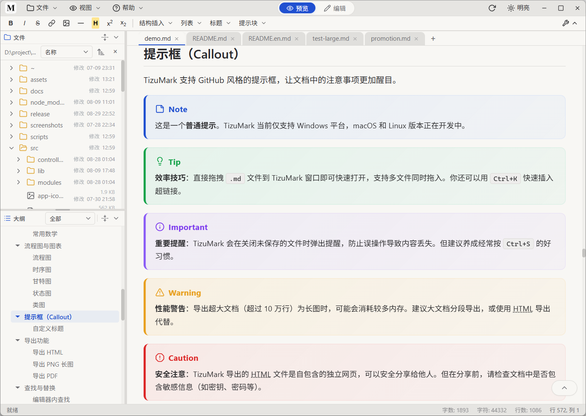

---

## 主题和字体，想怎么配就怎么配

亮色、暗色、跟随系统。切换时编辑器和预览区一起变，不是简单反色。

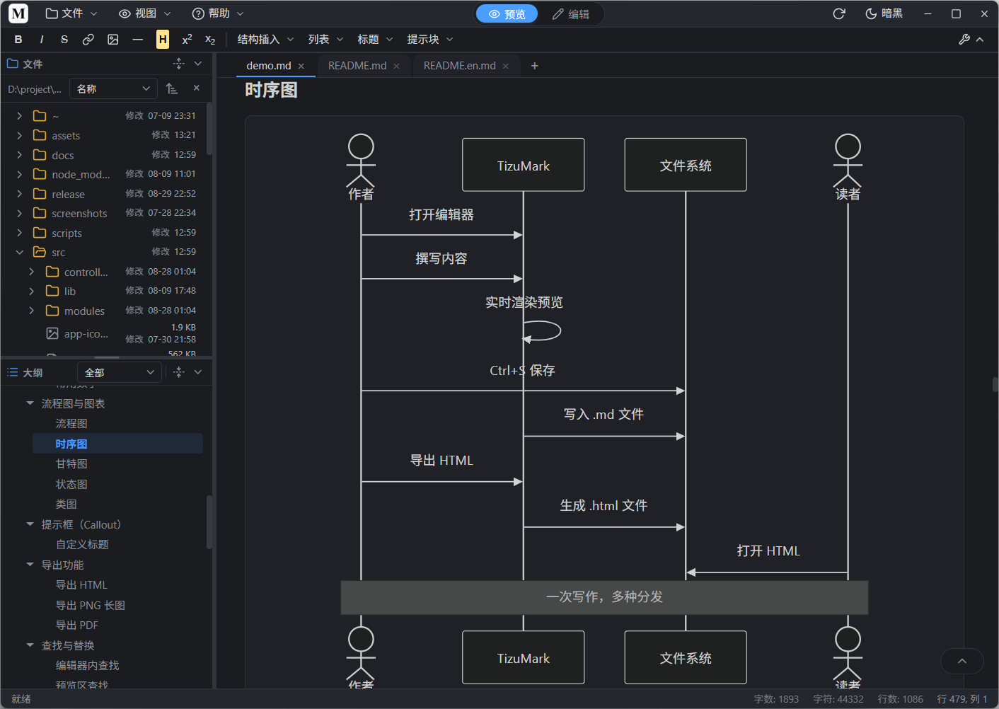

配色有 5 套：基准、暖橙风、翠林风、极夜风、暮紫风。

编辑器、预览、代码块三处字体可以分别设置。系统已安装的字体会全量列出、支持搜索（等线、微软雅黑、苹方、思源黑体……装了就能选），也可以导入自己的字体文件（ttf / otf / woff / woff2），带预览。

另外按住 `Ctrl` 滚滚轮可以无级缩放编辑器和预览字号，松手几秒后自动记住——嫌字号不合适又懒得进设置的时候很方便。

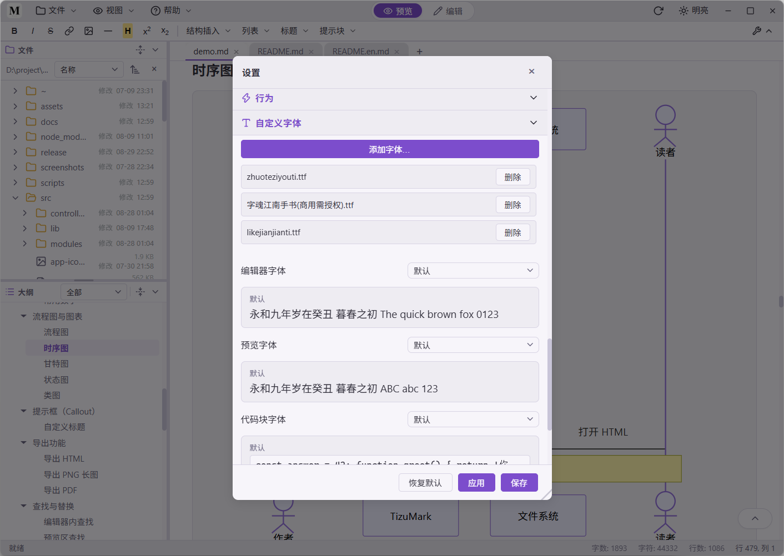

---

## 导出的活，顺手也干了

- **DOCX** — 交作业、交稿最省事的那种。公式和 Mermaid 图表会转成图片，任务列表变成 ☑/☐，代码块和提示框的样式转成 Word 认得的内联样式。图片会自动等比缩放：超过 500px 宽的按 500px 收，超过一页高的按高度反推缩小，小图保持原尺寸不放大，不会撑破页面也不会被拉糊。整个转换跑在后台线程，大文档不卡界面
- **HTML** — 单文件自包含，图片转 base64 内联，KaTeX 和 highlight.js 的样式一起嵌进去。不依赖外部资源，发给谁都能直接打开
- **PNG 长图** — 宽度 800px、高度自适应，2 倍图清晰度。发公众号、知乎、CSDN 可以直接用
- **PDF** — 走系统打印，页眉页脚、背景图形都可以自己设，排版所见即所得

四种都不需要额外装 Pandoc 之类的转换工具。

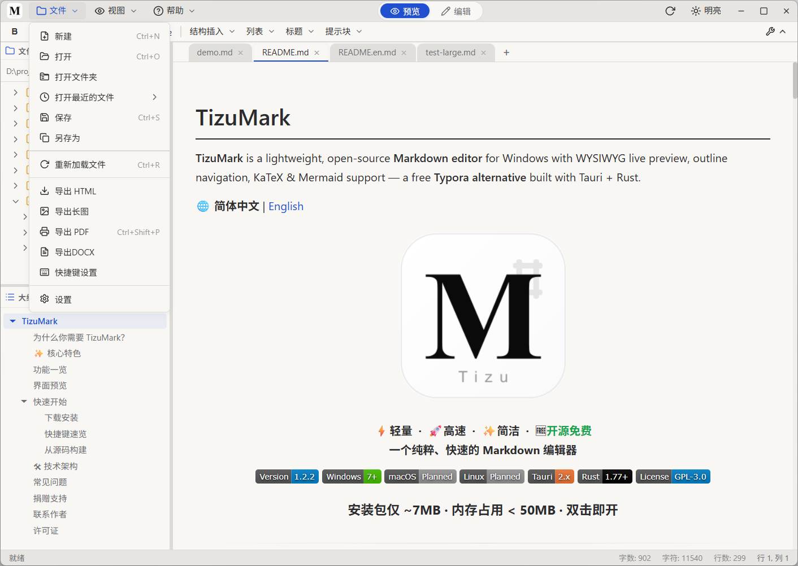

---

## 工具栏和快捷键

加粗、斜体、删除线、链接、图片、水平线、高亮、上标、下标，常用的都在工具栏上；「结构插入」下拉里有表格、代码块、引用块、公式、Mermaid、目录的模板。列表、六级标题、五种提示块也都能直接点。

工具栏可以一键折叠，回车换行渲染成 ` ` 还是保持段落也都能设。状态栏有实时字数统计。

快捷键方面，Ctrl+B 加粗、Ctrl+S 保存、Ctrl+\ 切换视图这些，不符合习惯就在面板里改：点「修改」，按下新组合键，立刻生效。嫌一条条改麻烦，内置了 **Default / VSCode / Typora / Sublime Text** 四套预设，一键整体切换——从别家迁过来，肌肉记忆可以直接沿用。

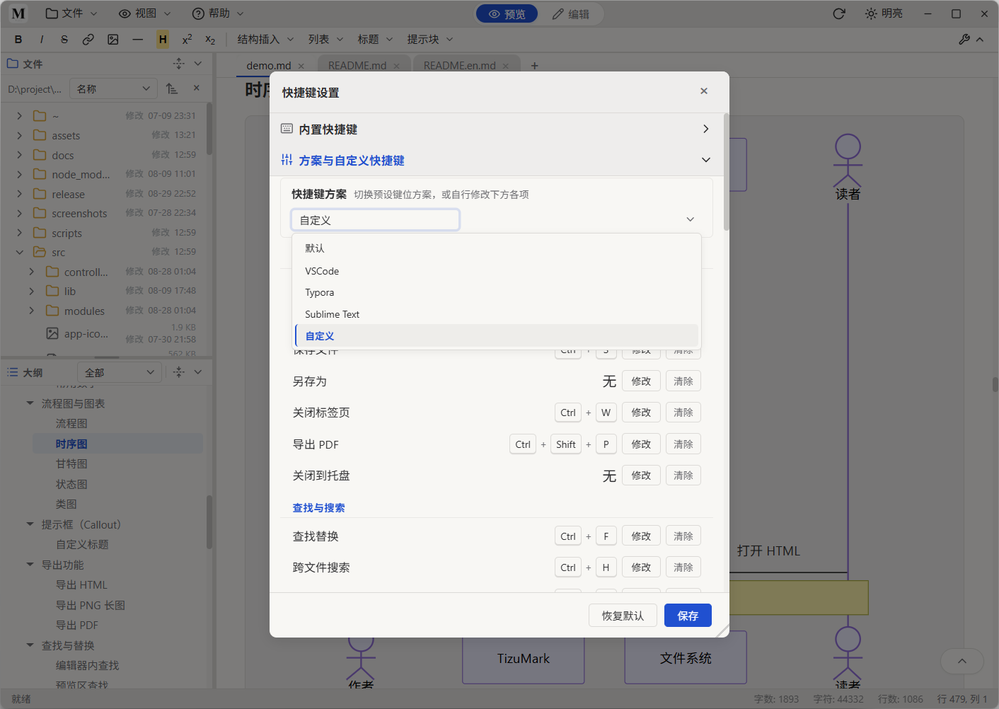

---

## 图片

- 粘贴自动去重（按 MD5），同一张图重复粘贴不会存第二份
- 本地图片、网络图片都支持
- 存储方式可选「复制到 assets/」或「Base64 嵌入」：前者利于版本管理，后者单文件就能分享
- 路径支持相对（移动文件夹不失联）和绝对两种模式
- 预览里点图片会弹出查看器，可以拖拽平移、**以光标为锚点**滚轮缩放、双击重置

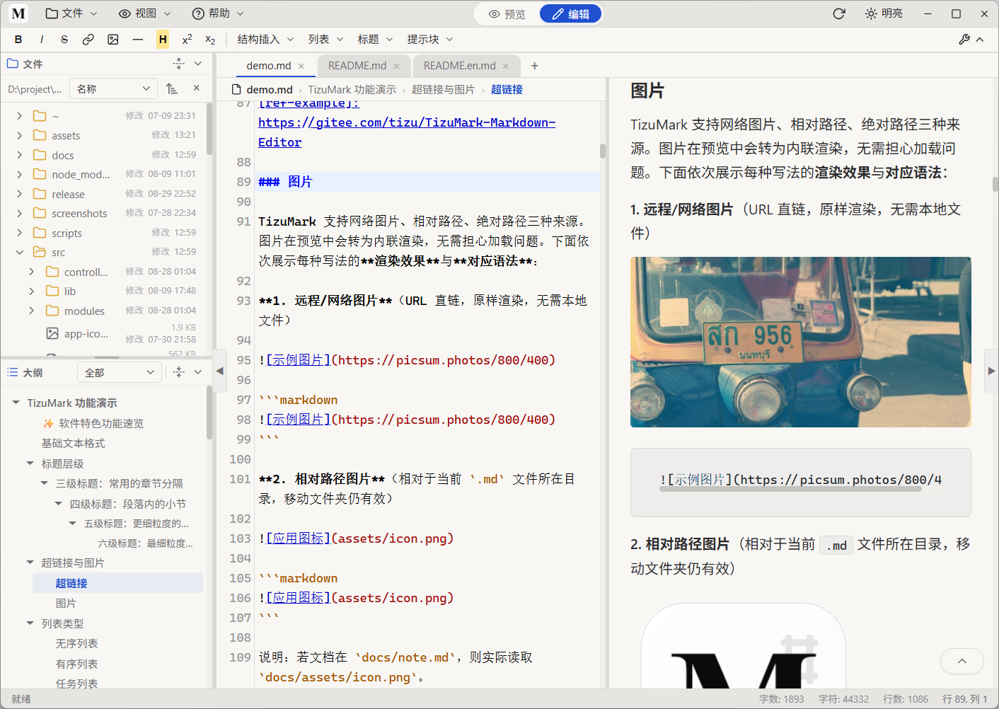

---

## 文件夹工作区

除了单文件，也可以 `文件 → 打开文件夹` 把整个目录装进来，侧边栏文件树随时浏览、点击即开。外部程序增删文件后会自动刷新；监听万一掉线，还能一键重连。

文件树右键可以做完整的文件操作：新建、剪切、复制、粘贴、重命名、删除，也能一键在系统文件管理器里打开所在目录。标签页右键提供关闭其他/全部、复制路径、打开所在目录。

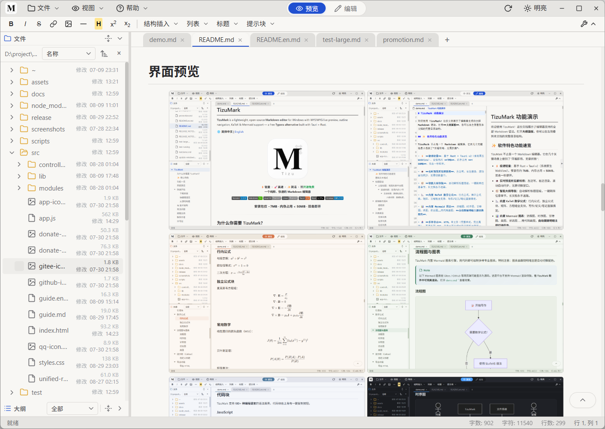

---

## 长文档也不卡

写小说、记笔记、整理资料，文档越来越长是常态。渲染上做了分块处理、围绕焦点窗口化预览，纯预览模式下还有虚拟滚动——只渲染当前阅读区域附近的内容，不会因为一次全量渲染把界面卡住。

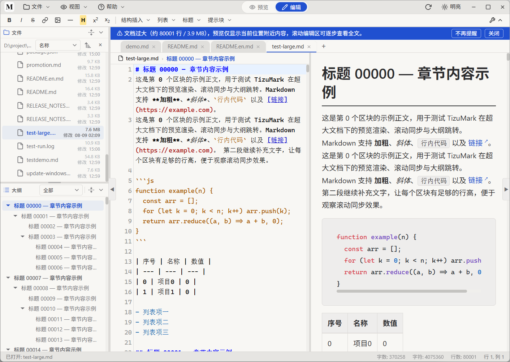

---

## 还有一些细节

视图方面，编辑器和预览可以分别折叠，想只看源码或只看成稿都行。

文件操作方面：`.md` / `.markdown` 文件关联，双击直接打开；文件或文件夹拖进窗口就能打开，支持批量；最近打开的文件会自动记录；文件被别的程序改了会提醒你重新加载，不会悄悄覆盖；关掉再打开，上次的标签页和工作区都还在。

系统层面：支持系统托盘，关闭窗口可以选退出 / 最小化到托盘 / 每次询问；启动后静默检查更新，有新版本弹提示并带下载进度；单实例运行——重复打开只会聚焦到已有窗口，新实例携带的文件还会交给已有窗口打开。

其他：编辑区、预览区、标签页各有自己的右键菜单（复制为 HTML、复制路径、关闭其他标签等）；界面中英双语可切换；内置 rehype-sanitize 净化管线，对渲染内容做 HTML / CSS 过滤，防 XSS。

不需要注册账号，不需要联网，完全离线可用。

---

## 下载

- Gitee（国内快）：https://gitee.com/tizu/TizuMark-Markdown-Editor/releases
- GitHub：https://github.com/tizuio/TizuMark-Markdown-Editor/releases

目前提供 **Windows** 版本，macOS 和 Linux 版本正在推进中。

下载安装包 → 双击 → 打开 → 开写。

> 首次安装或升级后会自动弹出「使用说明」和一份完整的语法演示 `demo.md`，照着过一遍基本就能上手，不用另外翻文档。也可以随时在 `帮助 → 使用说明` 里打开。

完全免费，装完就是全部功能。如果你也觉得写 Markdown 不该先做半小时准备工作，可以试试看。
